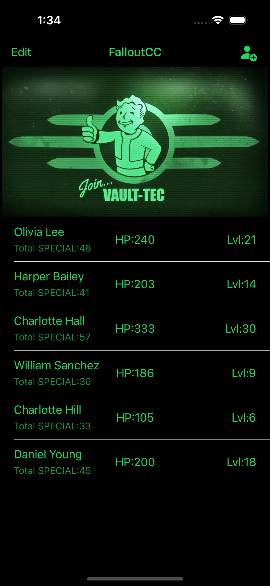
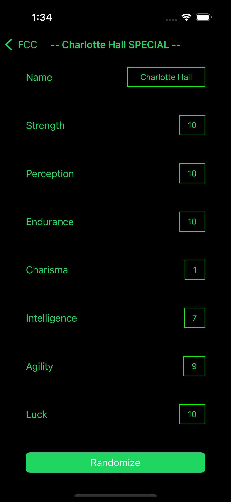

# FCC (Fallout Character Creation)

The FCC iOS mobile application is an app where you get to create characters meant for the game Fallout. You have the ability to change a characters S.P.E.C.I.A.L attributes, which is Strength, Perception, Endurance, Charisma, Intelligence, Agility, and Luck. These are all stats that you can edit and change how strong your character is!

## FCC Screenshots

### Home Page

### Detail View

